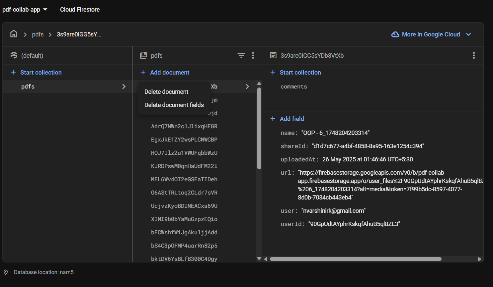
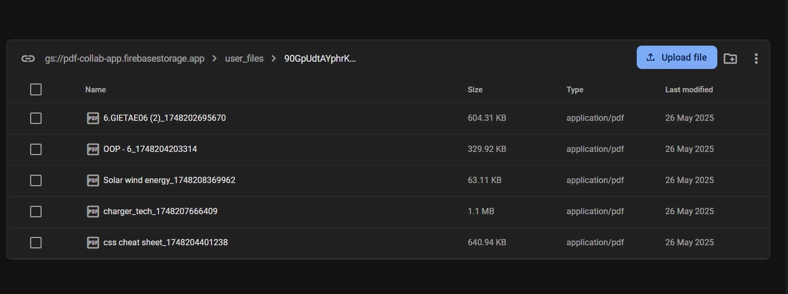

# Firestore & Storage Schema Documentation

---

## Firestore Database

### Collection: `pdfs`

Each document in this collection represents a PDF uploaded by a user.

**Fields:**

- **`name`** (`string`): Name of the PDF file.
- **`shareId`** (`string`): Unique share identifier for sharing the PDF.
- **`uploadedAt`** (`timestamp`): Upload date and time.
- **`url`** (`string`): Download URL for the PDF in Firebase Storage.
- **`user`** (`string`): Email of the uploader.
- **`userId`** (`string`): Firebase Auth UID of the uploader.

#### Subcollection: `comments`

Each PDF document can have a `comments` subcollection.

- **`text`** (`string`): Comment text.
- **`createdAt`** (`timestamp`): When the comment was made.
- **`email`** (`string`): Email of the commenter.

---

## Firebase Storage

### Bucket

```
gs://pdf-collab-app.firebasestorage.app
```

#### Folder Structure

```
user_files/{userId}/{filename}
```

#### Example

```
user_files/90GpUdtAYphrKskqfAhuB5ql8ZE3/6.GIETAE06 (2)_1748202695670
```

#### Description

- Each user has a folder under `user_files` named after their UID.
- Uploaded files are stored inside their respective user folder.
- The file name may include a timestamp or unique suffix for identification.

---

## Security Rules

### Storage Rules

```js
rules_version = '2';
service firebase.storage {
  match /b/{bucket}/o {
    match /user_files/{userId}/{allPaths=**} {
      allow read, write: if request.auth != null && request.auth.uid == userId;
    }
  }
}
```

---

## Screenshots

**Firestore Data:**



**Storage:**



---

**Project:** `pdf-collab-app`  
**Firebase Storage Bucket:** `gs://pdf-collab-app.firebasestorage.app`
